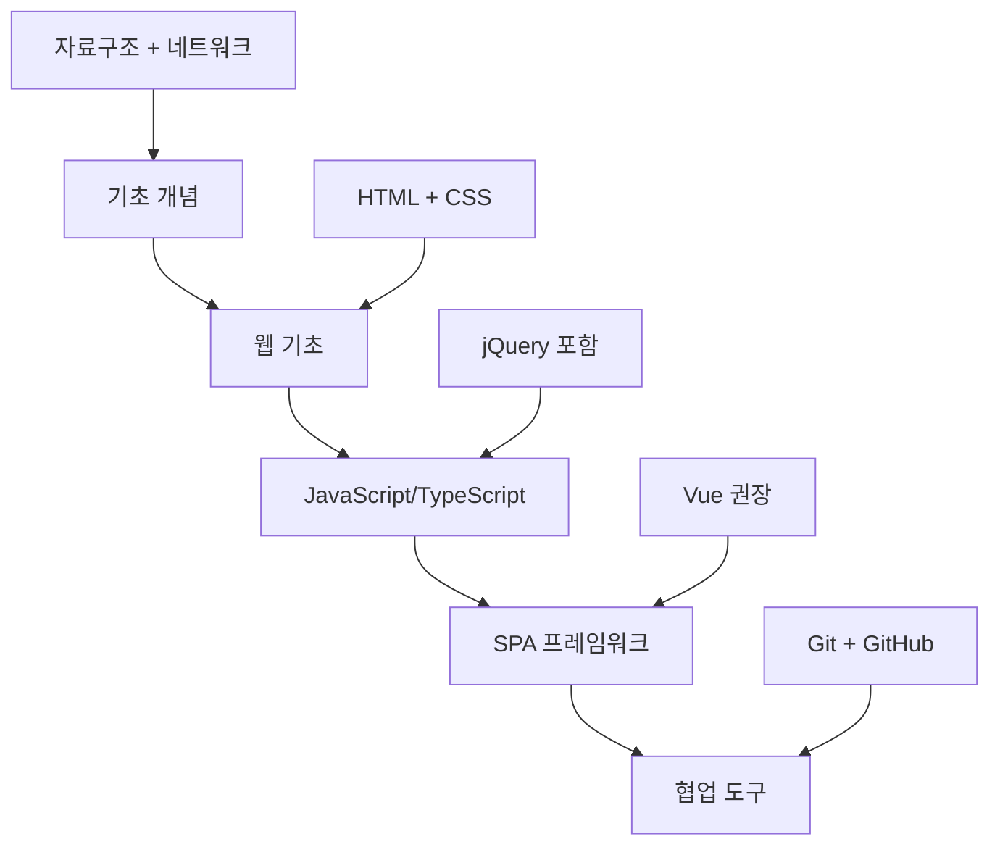

# 📚 Week 1: 개발 기초와 실무 준비

## 🎯 학습 목표

- **코딩 컨벤션과 주석** 작성법 습득
- **Git 기초**와 협업 워크플로우 이해
- **개발자 도구** 활용법과 디버깅 기초
- **독립적인 테스트 환경** 구축 방법
- **작업 이력 정리** 습관 형성

---

## 💡 핵심 마인드셋

### ✅ 기본 원칙
- **고객 우선**: 항상 고객의 관점에서 생각
- **품질 중시**: 완성도 높은 결과물 추구
- **협업 중시**: 팀원과의 원활한 소통
- **학습 의지**: 지속적인 기술 학습

### ✅ 코드 작성
- 남이 보는 것을 가정하고 작성
- 유지보수를 항상 고려
- 기능 구현뿐만 아니라 코드 관리 측면도 생각

---

## 🛣️ FE 개발자 로드맵

### 📚 필수 기초 지식

#### 🔧 핵심 개념

- **자료구조** (Python으로 학습 권장)
- **네트워크** (HTTP 프로토콜 필수)
- **알고리즘** (관심 정도만 가져도 됨)

> 💡 **비전공자 팁**: 정보처리기사 공부를 통해 기초 개념 습득 (자격증은 개인 판단)

#### 🌐 웹 기초

- **HTML & CSS**: FE 개발자라면 최소 한 번은 꼭 학습
- **JavaScript**: 기본 문법부터 고급 개념까지
- **TypeScript**: JavaScript와 함께 병행 학습
- **jQuery**: 기존 모바일 웹 유지보수 시 필요

### 🚀 진보된 기술 스택

#### 🎯 SPA 프레임워크

- **SPA** (Single Page Application) 개념 이해
  - React: 컴포넌트 기반의 유연한 라이브러리, 대규모 프로젝트에 적합
  - Vue: 학습하기 쉬운 프레임워크, 점진적 도입 가능
- **SSR** (Server-Side Rendering) 개념 이해
  - React: Next.js, Remix
  - Vue: Nuxt.js
- **Router**: 페이지 라우팅 관리
  - React: React Router
  - Vue: Vue Router
- **상태관리**: 컴포넌트 간 데이터 공유 및 상태 관리
  - React: Redux, Zustand
  - Vue: Pinia, Vuex
  > 💡 **SSR 사용시**: 서버에서 초기 데이터를 준비하므로 상태관리 라이브러리의 필요성이 상대적으로 줄어듦

#### 🔄 협업 도구

- **Git**: 소스 관리의 기본
- **GitHub**: 포트폴리오 및 협업 플랫폼
- **SVN**: 기존 레거시 프로젝트에서 사용하는 버전 관리 도구
  > 💡 **참고**: 신규 프로젝트는 대부분 Git을 사용하지만, 기존 SI 프로젝트에서는 SVN을 사용하는 경우가 있음

#### 🌿 브랜치 전략

- **GitHub Flow**: 간단한 브랜치 전략부터 시작
  - main 브랜치를 기준으로 기능별 브랜치 생성
  - Pull Request를 통한 코드 리뷰 및 머지
  - 단순하고 배우기 쉬워 신규 프로젝트에 적합
  > 💡 **추천**: 신입 개발자는 GitHub Flow부터 익히고, 프로젝트 규모에 따라 Git Flow 학습
- **Git Flow**: 체계적인 브랜치 관리가 필요한 대규모 프로젝트용
  - develop, feature, release, hotfix 브랜치 활용
  - 릴리즈 주기가 정해진 프로젝트에 적합
  - 초보자에게는 복잡할 수 있음
- **GitLab Flow**: GitHub Flow와 Git Flow의 중간 형태
  - production 브랜치 추가로 배포 환경 관리
  - environment 브랜치를 통한 단계별 배포
  - CI/CD 파이프라인과 잘 결합됨
- **Feature Branch Workflow**: 기능별 독립 개발에 집중
  - 각 기능마다 별도 브랜치에서 작업
  - 완료 후 main 브랜치로 머지
  - 소규모 팀에서 간단하게 사용하기 좋음

### 📈 학습 순서 권장사항



> ⚠️ **중요**: 모든 기술을 완벽하게 익힐 필요는 없습니다. 개발을 오래 할수록 필요해지므로 미리 조금씩 관심 가지고 공부하세요.

---

## 📝 코딩 컨벤션과 주석

### 🎯 주석 작성의 핵심 원칙

> **"주석은 코드가 '무엇'을 하는지가 아니라 '왜' 하는지를 설명해야 한다"**

#### 📋 주석 작성 우선순위

1. **비즈니스 로직의 이유**: 왜 이렇게 구현했는가?
2. **복잡한 알고리즘**: 로직의 의도와 동작 방식
3. **주의사항**: 수정 시 고려해야 할 사항
4. **임시 해결책**: 추후 개선이 필요한 부분

### 🏷️ 구조화된 주석 스타일

#### TODO와 FIXME 등 표준 주석 태그 활용

> **VSCode 확장 추천**: Todo Tree, Better Comments 설치하여 시각적 구분

```javascript
// TODO: 사용자 인증 기능 추가 필요
// FIXME: 메모리 누수 문제 해결 필요
// BUG: iOS에서 푸시 알림이 작동하지 않음
// NOTE: 이 함수는 비동기로 처리됩니다
// REVIEW: 성능 최적화 검토 필요
// OPTIMIZE: 이 쿼리를 캐싱으로 개선 가능
// DEPRECATED: 이 API는 v2.0에서 제거됩니다

// ! 중요하고 긴급한 사항
// ? 질문이나 의문사항
// * 중요한 강조 내용
```

#### 실무 주석 작성 예시

```javascript
// ✅ 비즈니스 로직 설명
const MAX_RETRY_COUNT = 3; // API 호출 실패 시 최대 재시도 횟수 (서버 정책 반영)

// ✅ 분기 처리 이유
if (userAgent.includes('Mobile')) {
  // 모바일 환경에서는 터치 이벤트 우선 처리 (iOS Safari 호환성)
  attachTouchEvents();
} else {
  // PC 환경에서는 마우스 이벤트 처리
  attachMouseEvents();
}

// ✅ 복잡한 로직 설명
// * 핵심: 사용자 권한에 따른 메뉴 필터링
/**
 * 사용자 권한에 따라 메뉴를 필터링
 * @param {Array} menuList - 전체 메뉴 목록
 * @param {string} userRole - 사용자 권한 (admin, user, guest)
 * @returns {Array} 권한에 맞는 메뉴 목록
 *
 * NOTE: 관리자는 모든 메뉴, 일반 사용자는 기본 메뉴만 표시
 * TODO: 역할별 세부 권한 체크 로직 추가
 */
function filterMenuByRole(menuList, userRole) {
  // ! 중요: 보안상 서버에서도 권한 검증 필요
  if (userRole === 'admin') {
    return menuList; // 관리자는 모든 메뉴 접근
  }

  // OPTIMIZE: 권한 매핑을 상수로 분리하여 성능 개선 가능
  return menuList.filter(menu => menu.accessLevel === 'public');
}

// ✅ 임시 해결책 표시
// FIXME: 현재 하드코딩된 값, 환경변수로 이동 필요
const API_ENDPOINT = 'https://api.example.com';

// ✅ 플랫폼별 처리 설명
// BUG: Android에서 뒤로가기 처리 시 앱 종료됨
function handleBackButton() {
  // NOTE: bizMOB 플랫폼에서 네이티브 뒤로가기 처리
  if (window.bizMOB && window.bizMOB.isApp) {
    // ? 이 방식이 모든 Android 버전에서 동작하는가?
    window.bizMOB.app.exitApp();
  }
}

// ✅ 성능 관련 주석
// OPTIMIZE: 대용량 데이터 처리 시 가상 스크롤링 적용 고려
function renderUserList(users) {
  // NOTE: 1000개 이상 데이터에서 성능 저하 발생
  if (users.length > 1000) {
    // TODO: 페이지네이션 또는 가상 스크롤링 구현
    console.warn('대용량 데이터 감지: 성능 최적화 필요');
  }

  return users.map(user => createUserCard(user));
}
```

#### ❌ 피해야 할 주석

```javascript
// ❌ 코드 자체로 명확한 내용
let count = 0; // count를 0으로 초기화
const users = getUsers(); // 사용자 목록을 가져온다

// ❌ 의미 없는 반복
function addUser(user) {
  // 사용자를 추가한다
  userList.push(user);
}

// ❌ 주석 처리된 코드 (삭제하거나 DEPRECATED 태그 사용)
// const oldFunction = () => {
//   return 'deprecated';
// };

// ❌ 너무 당연한 내용
i++; // i를 1 증가시킨다
```

### 🎨 Vue/TypeScript 프로젝트 주석 스타일

#### 컴포넌트 주석

```typescript
// * Vue 3 Composition API 스타일 컴포넌트
export default defineComponent({
  name: 'UserProfile',

  // NOTE: Props 정의 시 타입과 설명 명시
  props: {
    userId: {
      type: String,
      required: true,
      // ! 중요: 빈 문자열은 허용하지 않음
      validator: (value: string) => value.length > 0
    }
  },

  setup(props) {
    // TODO: 사용자 데이터 캐싱 로직 추가
    const userData = ref(null);

    // OPTIMIZE: API 호출 최적화 필요 (중복 호출 방지)
    const fetchUserData = async () => {
      try {
        // NOTE: bizMOB API 호출 표준 패턴
        const response = await api.get(`/users/${props.userId}`);
        userData.value = response.data;
      } catch (error) {
        // BUG: 에러 처리가 사용자에게 표시되지 않음
        console.error('사용자 데이터 로드 실패:', error);
      }
    };

    // REVIEW: 이 computed가 정말 필요한가?
    const displayName = computed(() => {
      return userData.value?.name || '이름 없음';
    });

    return {
      userData,
      displayName,
      fetchUserData
    };
  }
});
```

#### 비즈니스 로직 주석

```typescript
class AuthService {
  // ! 보안상 중요: API 키는 환경변수에서 가져와야 함
  private apiKey: string;

  constructor() {
    // FIXME: 하드코딩된 API 키 제거
    this.apiKey = import.meta.env.VITE_API_KEY || '';
  }

  // * 핵심 로그인 메서드
  async login(email: string, password: string): Promise<UserProfile> {
    // ? 비밀번호 유효성 검사가 충분한가?
    if (!this.validatePassword(password)) {
      throw new Error('Invalid password');
    }

    try {
      // NOTE: bizMOB 네이티브 암호화 사용
      const encryptedData = await this.encryptCredentials(email, password);

      // OPTIMIZE: 캐싱을 통해 반복 요청 최적화 가능
      const response = await fetch('/api/login', {
        method: 'POST',
        body: JSON.stringify(encryptedData)
      });

      return await response.json();
    } catch (error) {
      // BUG: 에러 처리가 불완전함
      console.error('Login failed:', error);
      throw error;
    }
  }

  // DEPRECATED: v1.0 호환성을 위해 유지, v2.0에서 제거 예정
  legacyLogin(username: string): Promise<UserProfile> {
    // REVIEW: 이 메서드가 여전히 필요한지 검토
    return this.login(username, '');
  }
}
```

### 🏷️ 네이밍 컨벤션

#### 📚 기본 네이밍 원칙

1. **명확성**: 변수명만 보고도 역할을 이해할 수 있어야 함
2. **일관성**: 프로젝트 전체에서 동일한 규칙 적용
3. **간결성**: 불필요하게 길지 않되, 의미는 명확하게

#### 변수/함수명 규칙 (camelCase)

```javascript
// ✅ 의미가 명확한 이름
const isLoggedIn = checkUserLoginStatus();
const userProfileData = fetchUserProfile();
const totalOrderAmount = calculateTotalAmount();

// ✅ Boolean 변수는 is/has/can 등으로 시작
const isVisible = true;
const hasPermission = false;
const canEdit = checkEditPermission();

// ✅ 함수명은 동사로 시작
const handleLoginButtonClick = () => { /* ... */ };
const validateEmailFormat = (email) => { /* ... */ };
const fetchUserData = async () => { /* ... */ };

// ✅ 이벤트 핸들러는 handle/on 접두사
const handleSubmit = () => { /* ... */ };
const onUserSelect = (user) => { /* ... */ };

// ❌ 의미 불분명한 이름
const flag = check();
const data = fetch();
const fn = () => { /* ... */ };
const temp = getValue();
```

#### 상수명 규칙 (SCREAMING_SNAKE_CASE)

```javascript
// ✅ 대문자와 언더스코어
const API_BASE_URL = 'https://api.example.com';
const DEFAULT_PAGE_SIZE = 20;
const MAX_RETRY_ATTEMPTS = 3;
const SESSION_TIMEOUT_MINUTES = 30;

// ✅ 에러 메시지 상수화
const ERROR_MESSAGES = {
  NETWORK_ERROR: '네트워크 오류가 발생했습니다.',
  INVALID_INPUT: '입력값이 올바르지 않습니다.',
  PERMISSION_DENIED: '접근 권한이 없습니다.',
  SESSION_EXPIRED: '세션이 만료되었습니다.'
};

// ✅ 상태 값 상수화
const USER_STATUS = {
  ACTIVE: 'active',
  INACTIVE: 'inactive',
  PENDING: 'pending',
  SUSPENDED: 'suspended'
} as const;
```

#### 클래스/인터페이스명 규칙 (PascalCase)

```typescript
// ✅ 클래스명
class UserAuthService {
  // 클래스 내용...
}

class PaymentProcessor {
  // 클래스 내용...
}

// ✅ 인터페이스명
interface UserProfile {
  id: string;
  name: string;
  email: string;
}

interface ApiResponse<T> {
  data: T;
  message: string;
  status: number;
}

// ✅ 타입명
type UserRole = 'admin' | 'user' | 'guest';
type LoginStatus = 'pending' | 'success' | 'failed';
```

#### 파일/폴더명 규칙

```text
// ✅ 컴포넌트 파일 (PascalCase)
UserProfile.vue
LoginForm.vue
NavBar.vue

// ✅ 일반 파일 (kebab-case)
user-service.ts
api-client.ts
utils.ts

// ✅ 폴더명 (kebab-case 또는 camelCase)
components/
user-management/
api/
assets/
```

#### 실무에서 자주 사용하는 네이밍 패턴

```javascript
// ✅ 배열은 복수형
const users = [];
const menuItems = [];
const errorMessages = [];

// ✅ 객체는 단수형
const user = { id: 1, name: 'John' };
const config = { timeout: 5000 };

// ✅ 함수명 패턴
// 조회: get, fetch, load
const getUserById = (id) => { /* ... */ };
const fetchUserData = async () => { /* ... */ };
const loadConfiguration = () => { /* ... */ };

// 생성: create, add, insert
const createUser = (userData) => { /* ... */ };
const addMenuItem = (item) => { /* ... */ };

// 수정: update, modify, edit
const updateUserProfile = (id, data) => { /* ... */ };
const modifySettings = (settings) => { /* ... */ };

// 삭제: delete, remove
const deleteUser = (id) => { /* ... */ };
const removeFromCart = (itemId) => { /* ... */ };

// 검증: validate, check, verify
const validateEmail = (email) => { /* ... */ };
const checkPermission = (user, action) => { /* ... */ };
const verifyToken = (token) => { /* ... */ };
```

#### Vue 컴포넌트 네이밍

```vue
<!-- ✅ 컴포넌트명은 PascalCase -->
<template>
  <div class="user-profile">
    <!-- ✅ HTML 속성은 kebab-case -->
    <user-avatar :image-url="user.avatar" />
    <user-info :user-data="user" />
  </div>
</template>

<script>
export default {
  name: 'UserProfile', // ✅ 컴포넌트명

  // ✅ Props는 camelCase로 정의하지만 템플릿에서는 kebab-case로 사용
  props: {
    userData: Object,
    showAvatar: Boolean
  },

  data() {
    return {
      // ✅ data 속성은 camelCase
      isLoading: false,
      userDetails: null
    };
  },

  computed: {
    // ✅ computed는 명사형
    fullName() {
      return `${this.userData.firstName} ${this.userData.lastName}`;
    },

    // ✅ Boolean computed는 is/has/can 접두사
    isProfileComplete() {
      return this.userData.name && this.userData.email;
    }
  },

  methods: {
    // ✅ 메서드는 동사형
    handleProfileUpdate() {
      // 구현...
    },

    validateUserInput() {
      // 구현...
    }
  }
};
</script>
```

#### 💡 실무 네이밍 팁

```javascript
// ✅ 약어 사용 시 일관성 유지
const userId = 'user123';  // user + Id
const userInfo = {};       // user + Info (정보)
const userAPI = {};        // user + API

// ✅ 숫자가 포함된 경우
const api2Client = {};     // 버전2 API 클라이언트
const httpStatus200 = 200; // HTTP 상태 코드

// ✅ 임시 변수는 의미 있는 이름 사용
// ❌ 나쁜 예
let temp = user.name;
let i = 0;

// ✅ 좋은 예
let userName = user.name;
let userIndex = 0;

// ✅ 조건부 변수는 명확하게
const hasValidEmail = user.email && validateEmail(user.email);
const shouldShowModal = !isLoggedIn && !hasSeenWelcome;
```

---

## 🌿 Git 기초와 협업

### 🎯 Git 핵심 개념

#### 기본 상태 이해

```bash
# 작업 영역 상태 확인
git status

# 파일 추가 (Staging Area로 이동)
git add 파일명
git add .  # 모든 변경사항 추가

# 커밋 (로컬 저장소에 저장)
git commit -m "커밋 메시지"

# 원격 저장소로 전송
git push origin 브랜치명
```

#### 기본 Git 명령어

```bash
# 저장소 복제
git clone https://github.com/user/repo.git

# 원격 저장소 변경사항 가져오기
git pull origin main

# 브랜치 생성 및 이동
git checkout -b feature/new-feature
git switch -c feature/new-feature  # 최신 방식

# 브랜치 목록 확인
git branch -a

# 브랜치 병합
git merge feature/new-feature

# 변경 이력 확인
git log --oneline
```

### 📋 GitHub Flow 기본 원칙

> 너무 어려울 필요 없이 **GitHub Flow** 정도로만 알아두자

```bash
# 1. 최신 main 브랜치로 시작
git checkout main
git pull origin main

# 2. 기능별 브랜치 생성
git checkout -b feature/login-validation

# 3. 작업 후 커밋
git add .
git commit -m "feat: 로그인 폼 유효성 검사 추가"

# 4. 원격 저장소에 푸시
git push origin feature/login-validation

# 5. Pull Request 생성 및 코드 리뷰
# 6. 리뷰 완료 후 main에 머지
```

### 💬 커밋 메시지 규칙

#### Conventional Commits 사용

```bash
# ✅ 명확한 커밋 메시지
feat: 사용자 로그인 기능 추가
fix: 페이지네이션 버그 수정
docs: API 문서 업데이트
style: 코드 포맷팅 정리
refactor: 사용자 인증 로직 개선
test: 로그인 컴포넌트 테스트 추가
chore: 빌드 스크립트 업데이트

# ❌ 불명확한 커밋 메시지
git commit -m "수정"
git commit -m "작업완료"
git commit -m "버그픽스"
```

#### 커밋 메시지 템플릿

```bash
# 제목: 50자 이내로 간결하게
# 빈 줄
# 본문: 필요시 상세 설명 (72자 단위로 줄바꿈)
# 빈 줄
# 꼬리말: 이슈 번호 등

feat: 사용자 프로필 편집 기능 추가

- 사용자가 이름, 이메일, 프로필 사진을 수정할 수 있음
- 유효성 검사 및 에러 처리 포함
- 반응형 디자인 적용

Closes #123
```

### 🔀 실무에서 자주 사용하는 Git 시나리오

#### 1. 작업 중 급하게 다른 브랜치로 이동해야 할 때

```bash
# 작업 임시 저장
git stash

# 다른 브랜치 작업 후
git checkout original-branch
git stash pop  # 임시 저장된 작업 복원
```

#### 2. 잘못된 커밋 수정

```bash
# 마지막 커밋 메시지 수정
git commit --amend -m "올바른 커밋 메시지"

# 여러 커밋을 하나로 합치기 (squash)
git rebase -i HEAD~3  # 최근 3개 커밋 수정
```

#### 3. 특정 파일만 이전 버전으로 되돌리기

```bash
# 특정 파일을 이전 커밋 상태로 복원
git checkout HEAD~1 -- filename.js

# 특정 커밋의 변경사항만 가져오기
git cherry-pick commit-hash
```

### 🤝 팀 협업 Best Practices

#### Pull Request 작성 가이드

```markdown
## PR 제목
feat: 사용자 알림 기능 구현

## 변경 사항
- 실시간 알림 수신 기능 추가
- 알림 목록 페이지 구현
- 읽음/읽지않음 상태 관리

## 테스트 방법
1. 로그인 후 알림 페이지 접속
2. 새 알림 발생시 실시간 업데이트 확인
3. 알림 클릭시 읽음 처리 확인

## 스크린샷
[이미지 첨부]

## 체크리스트
- [x] 코드 리뷰 준비 완료
- [x] 테스트 케이스 추가
- [x] 문서 업데이트
```

#### 코드 리뷰 시 주의사항

```text
👍 좋은 리뷰 예시:
- "이 부분에서 예외 처리를 추가하면 어떨까요?"
- "성능 최적화를 위해 memo를 고려해볼 수 있을 것 같습니다"
- "네이밍이 명확해서 이해하기 쉽네요!"

❌ 피해야 할 리뷰:
- "이건 왜 이렇게 했나요?" (이유 없는 질문)
- "전체를 다시 작성하세요" (구체적 대안 없음)
- "별로네요" (건설적이지 않은 의견)
```

### 🛠️ 실무 Git 도구 추천

#### GUI 도구

- **SourceTree**: 무료, 직관적인 브랜치 시각화
- **GitHub Desktop**: 간단한 작업에 최적화
- **TortoiseGit**: Windows 탐색기 통합, 우클릭으로 Git 명령 실행 가능
- **GitKraken**: 고급 기능, 유료

#### VSCode 확장

- **GitLens**: 코드 라인별 Git 정보 표시
- **Git Graph**: 브랜치 그래프 시각화
- **Git History**: 파일 변경 이력 확인

### ⚠️ 실무에서 주의할 점

#### 절대 하면 안 되는 것

```bash
# ❌ main 브랜치에 직접 push
git push origin main

# ❌ force push (팀 작업시)
git push --force

# ❌ 민감한 정보 커밋
git add .env
git add config/database.yml
```

#### 안전한 작업 습관

```bash
# ✅ 작업 전 항상 pull
git pull origin main

# ✅ 브랜치 확인 후 작업
git branch  # 현재 브랜치 확인

# ✅ 커밋 전 변경사항 확인
git diff
git status
```

---

## 📋 프로젝트 기록 관리

### 🎯 왜 프로젝트 기록이 필요한가?

> **"내가 진행한 프로젝트는 어딘가에 기록해둬야 한다"**

```text
💡 실무에서 꼭 필요한 이유:

✅ 이력서 작성시 구체적 내용 기재
✅ 면접에서 실무 경험 설명 가능
✅ 유사한 문제 발생시 빠른 해결
✅ 승진/평가시 성과 증명 자료
```

### 📊 간단한 프로젝트 기록 방법

#### **기본 프로젝트 기록 템플릿**

```markdown
# 프로젝트명: OO 시스템 구축

## 기본 정보
- **기간**: 2024.01 ~ 2024.06 (6개월)
- **역할**: 프론트엔드 개발
- **고객**: OO 공공기관
- **기술**: Vue.js 3, JavaScript, CSS

## 주요 담당 업무
- 사용자 관리 화면 개발
- 대시보드 차트 기능
- 모바일 반응형 구현

## 기술적 이슈와 해결
**문제**: 대용량 데이터 렌더링 성능 저하
**해결**: 페이지네이션 + 가상 스크롤링 적용
**결과**: 로딩 시간 10초 → 2초 단축

## 배운 점
- Vue 3 Composition API 실무 활용
- 성능 최적화 기법
- 공공기관 프로젝트 특성
```

#### **피드백 기록 (프로젝트 종료 후)**

실제 프로젝트에서 나온 피드백 예시:

```markdown
## OO 프로젝트 After 피드백

### 개선이 필요한 부분
- 함수가 이곳저곳 퍼져있어서 통합 필요
- 네이밍 규칙 정리 필요
- 공통 코드 처리를 store에서 관리하도록 개선

### 다음 프로젝트에서 적용할 점
- request 함수에 GET, POST 메소드 명칭 추가
- ref, reactive 차이점 명확히 구분해서 사용
- computed 활용해서 HTML에서 로직 최소화

### 새로 배운 기술
- useIonRouter 활용법
- 모달과 화면 조작 분리 방법
- Ionic 라이프사이클 훅 적용
```

### 💾 실용적인 기록 보관법

#### **1. 간단한 폴더 구조**

```text
📁 내_프로젝트_기록/
├── 📄 경력_프로필.md (전체 이력)
├── 📄 피드백_모음.md (프로젝트별 피드백)
├── 📂 2024년/
│   ├── 📄 HD현대_프로젝트.md
│   └── 📄 NS_차세대_프로젝트.md
└── 📂 기술_노트/
    ├── 📄 Vue3_경험.md
    └── 📄 문제해결_모음.md
```

#### **2. 추천 도구**

```text
💻 도구 선택:

간단한 시작:
- 메모장 or 노트패드++
- GitHub 개인 저장소
- 회사 OneDrive/GoogleDrive

체계적 관리:
- Notion (템플릿 활용)
- Obsidian (연결된 노트)
```

#### **3. 기록 주기**

```text
📅 현실적인 기록 주기:

프로젝트 중 (월 1회):
- 이번 달 주요 작업 내용
- 해결한 기술적 문제

프로젝트 종료시 (2시간):
- 전체 프로젝트 정리
- 피드백 내용 기록
- 다음에 적용할 점 정리

반기별 (1시간):
- 경력 프로필 업데이트
- 이력서 내용 보완
```

### 📊 경력 관리 테이블

실제 경력 관리 예시:

```markdown
| 프로젝트 | 고객 | 기간 | 담당업무 | 기술스택 |
|:-|:-|:-|:-|:-|
| {프로젝트명} | {고객사} | {기간} | {담당업무} | Vue.js |
```

### 🔧 실무 팁

#### **기록시 주의사항**

```text
⚠️ 보안 고려:
- 고객사 기밀정보 제외
- 일반적인 기술 내용 위주
- 회사 승인된 범위에서 작성

✅ 효과적인 기록:
- 구체적인 수치 포함 (성능 개선 %)
- Before/After 비교
- 핵심 배운 점 위주
```

---

## 🔧 개발자 도구와 디버깅

### 🌐 브라우저 개발자 도구 활용

#### Console 활용법

```javascript
// ✅ 단계별 디버깅
console.log('함수 시작:', functionName);
console.log('변수 상태:', { userId, userName, userRole });
console.log('API 응답:', response);

// ✅ 조건부 로깅
if (process.env.NODE_ENV === 'development') {
  console.log('개발 모드 디버그:', debugData);
}

// ✅ 성능 측정
console.time('API 호출 시간');
await fetchUserData();
console.timeEnd('API 호출 시간');
```

#### Network Tab 활용

- API 호출 상태 확인
- 응답 시간 모니터링
- 에러 응답 분석
- 요청/응답 헤더 확인

#### Elements Tab 활용

- DOM 구조 분석
- CSS 스타일 실시간 수정
- 반응형 디자인 테스트
- 접근성 문제 확인

### 🐛 기본 디버깅 전략

#### 1단계: 문제 범위 좁히기

```javascript
// 함수 입구에서 파라미터 확인
function processUserData(userData) {
  console.log('입력 데이터:', userData);

  if (!userData) {
    console.error('userData가 없습니다');
    return;
  }

  // 처리 로직...
}
```

#### 2단계: 단계별 상태 확인

```javascript
// 각 처리 단계마다 상태 로깅
async function fetchAndProcessData() {
  console.log('1. 데이터 조회 시작');
  const rawData = await fetchData();
  console.log('2. 조회 완료:', rawData);

  console.log('3. 데이터 가공 시작');
  const processedData = processData(rawData);
  console.log('4. 가공 완료:', processedData);

  return processedData;
}
```

---

## 🧪 독립적인 테스트 환경 구축

### 🎯 핵심 원칙

> **"서버를 기다리지 말고 혼자 테스트할 방법을 생각하라"**

### 🏗️ Mock 데이터 활용

> **💡 핵심 원칙**: Mock 데이터도 실제 API와 동일한 **비동기 형식**으로 구현해야 실제 API 연동 시 버그가 덜 발생합니다.

#### 간단한 Mock API

```javascript
// mockData.js
export const mockUsers = [
  { id: 1, name: '김개발', role: 'admin' },
  { id: 2, name: '이프론트', role: 'user' },
  { id: 3, name: '박백엔드', role: 'user' }
];

// ✅ 비동기 Mock API (권장)
async function fetchUsers() {
  if (process.env.NODE_ENV === 'development') {
    // 실제 API 지연시간 시뮬레이션 (100-500ms)
    await new Promise(resolve => setTimeout(resolve, 200));

    // 가끔 에러 시뮬레이션 (테스트용)
    if (Math.random() < 0.1) {
      throw new Error('네트워크 오류 시뮬레이션');
    }

    return mockUsers;
  } else {
    // 운영 환경에서는 실제 API 호출
    return fetch('/api/users').then(res => res.json());
  }
}

// ❌ 동기 Mock (피해야 할 방식)
function fetchUsersSyncBad() {
  return mockUsers; // 실제 API는 비동기인데 Mock은 동기 → 버그 위험
}
```

#### 비동기 Mock의 장점

```javascript
// ✅ 실제 API와 동일한 패턴으로 컴포넌트 작성 가능
async function loadUserData() {
  try {
    setLoading(true);
    const users = await fetchUsers(); // Mock이든 실제 API든 동일한 방식
    setUsers(users);
  } catch (error) {
    console.error('사용자 데이터 로드 실패:', error);
    setError(error.message);
  } finally {
    setLoading(false);
  }
}

// 로딩 상태, 에러 처리 등을 Mock 단계에서부터 테스트 가능
```

#### localStorage를 활용한 임시 데이터

```javascript
// 임시 데이터 저장/조회
function saveTestData(key, data) {
  localStorage.setItem(`test_${key}`, JSON.stringify(data));
}

function getTestData(key) {
  const data = localStorage.getItem(`test_${key}`);
  return data ? JSON.parse(data) : null;
}

// 사용 예시
saveTestData('userList', mockUsers);
const testUsers = getTestData('userList');
```

### 🔍 독립 테스트 방법론

#### 1. 컴포넌트 단위 테스트

```html
<!-- 단일 컴포넌트 테스트 페이지 -->
<!DOCTYPE html>
<html>
<head>
  <title>로그인 폼 테스트</title>
</head>
<body>
  <div id="test-area">
    <!-- 테스트할 컴포넌트만 렌더링 -->
  </div>

  <script>
    // 테스트 시나리오 작성
    testLoginForm();
  </script>
</body>
</html>
```

#### 2. 브라우저 콘솔에서 함수 테스트

```javascript
// 개발자 도구 콘솔에서 직접 함수 테스트
window.testUtils = {
  validateEmail: (email) => {
    const regex = /^[^\s@]+@[^\s@]+\.[^\s@]+$/;
    return regex.test(email);
  },

  formatPhone: (phone) => {
    return phone.replace(/(\d{3})(\d{4})(\d{4})/, '$1-$2-$3');
  }
};

// 콘솔에서 테스트
// testUtils.validateEmail('test@example.com'); // true
// testUtils.formatPhone('01012345678'); // 010-1234-5678
```

---

## ✅ 실무 체크리스트

### 📋 개발 전 준비사항

- 요구사항 명확히 이해했는가?
- 파일의 설계/구조를 먼저 생각했는가?
- 테스트 방법을 계획했는가?

### 📋 개발 중 점검사항

- 코드가 너무 복잡하지 않은가?
- 주석이 필요한 부분에 작성했는가?
- 에러 처리를 했는가?

### 📋 개발 완료 후 점검사항

- 다양한 케이스로 자체 테스트를 충분히 했는가?
- 브라우저 호환성을 확인했는가?

---

## 📚 참고 자료

### 🔗 학습 링크

- <a href="https://git-scm.com/book/ko/v2" target="_blank">Git 기초 가이드</a>
- <a href="https://github.com/airbnb/javascript" target="_blank">JavaScript 스타일 가이드</a>
- <a href="https://developer.chrome.com/docs/devtools/overview?hl=ko" target="_blank">Chrome 개발자 도구 가이드</a>

### 💡 추천 도구

- **코드 에디터**: VSCode + 유용한 확장프로그램
- **Git GUI**: GitHub Desktop (초보자용)
- **API 테스트**: Postman 또는 브라우저 Network 탭

---

**📧 질문이 있으시면 언제든 연락주세요!**

**프로젝트수행팀 최명훈 (<mhchoi@mcnc.co.kr>)**
